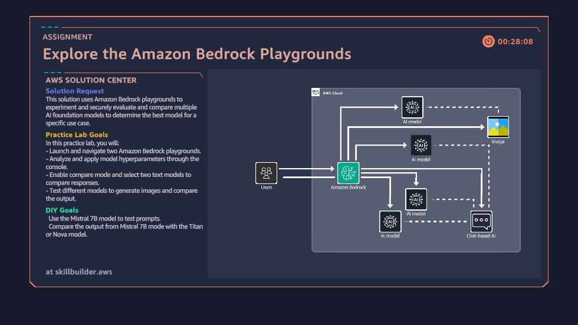
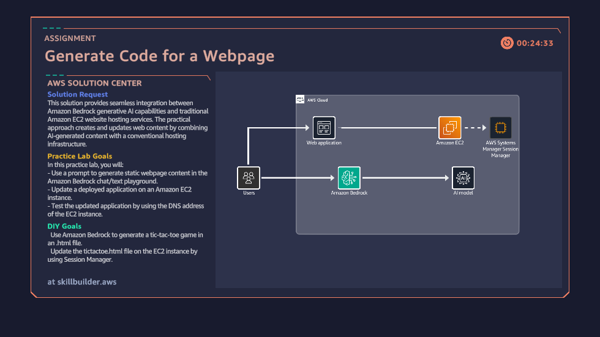
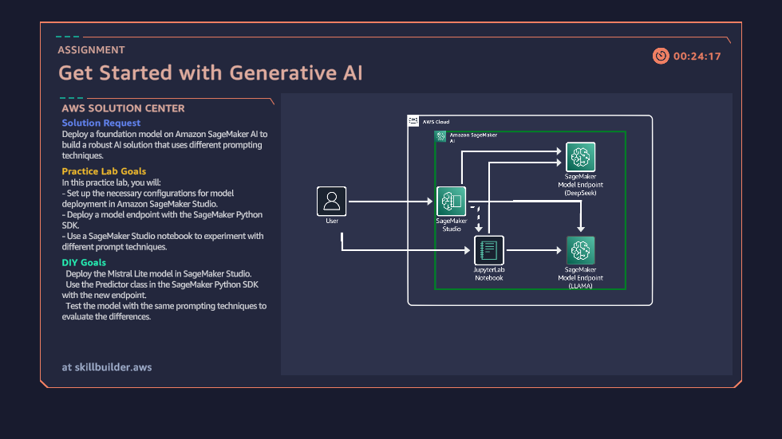
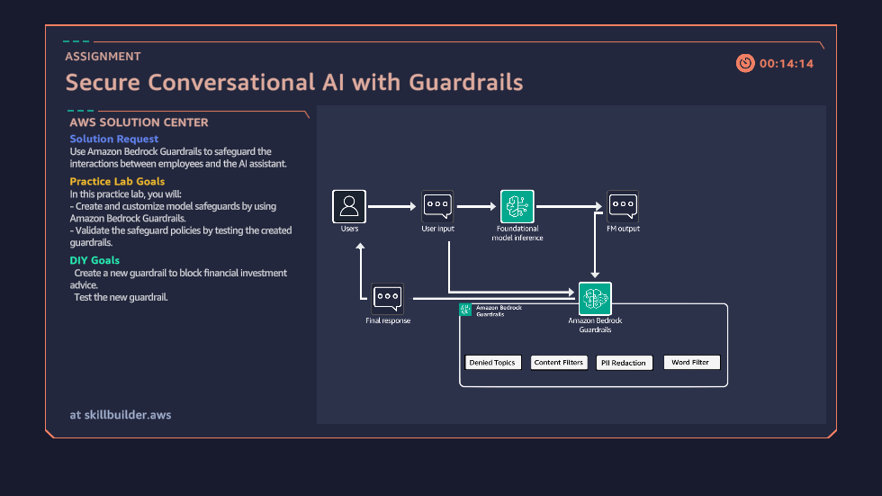
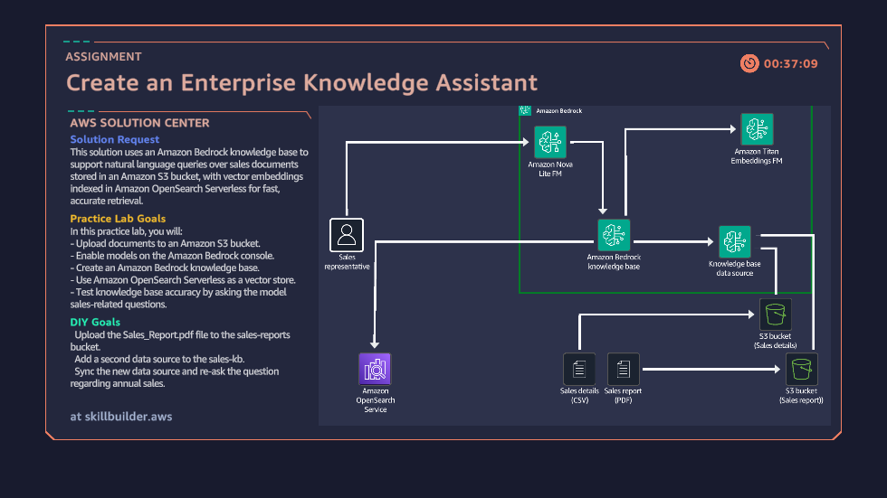
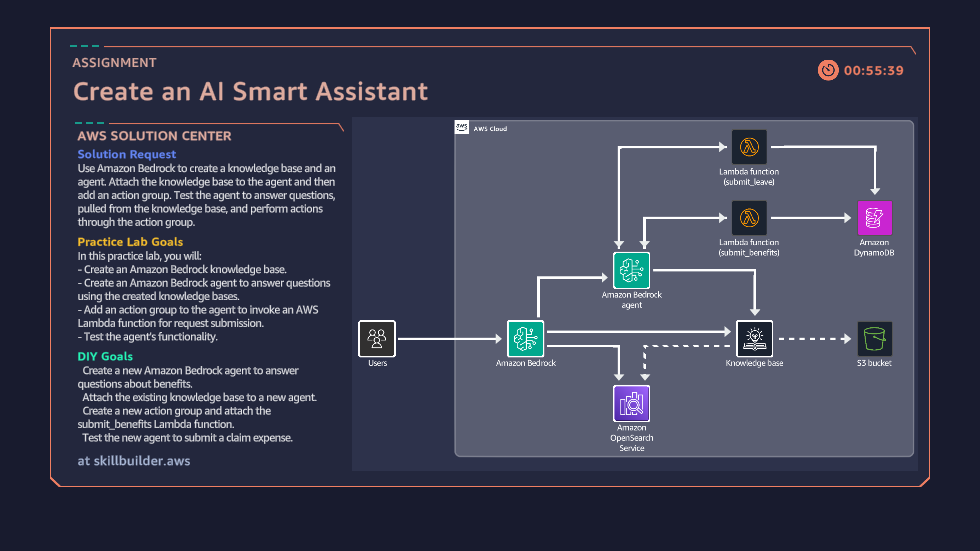
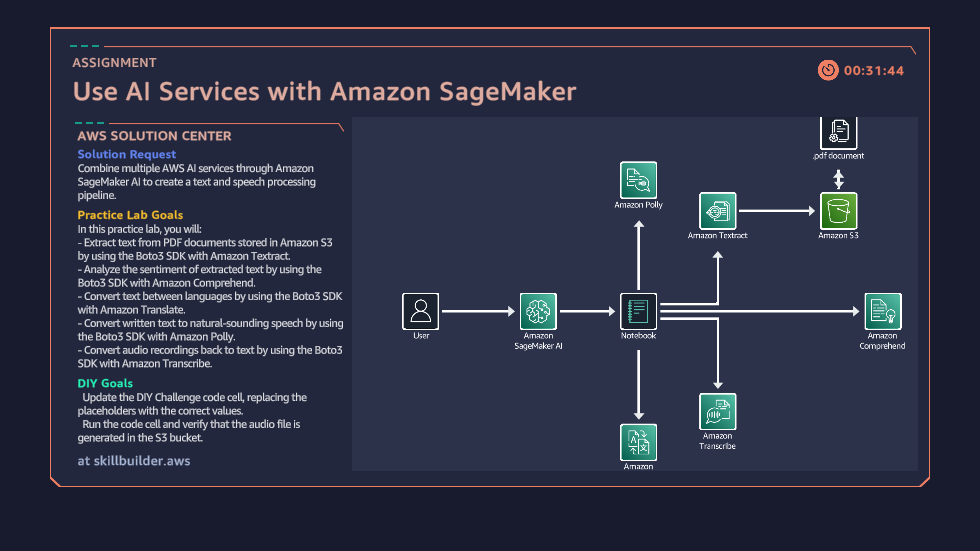
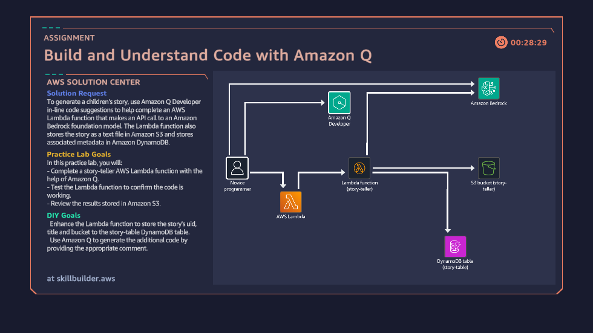

# 🚀 AWS Cloud Quest: Generative AI Practitioner

This repository documents my hands-on journey through the **AWS Cloud Quest: Generative AI Practitioner** role-based learning path.

Through **10 real-world assignments**, I built practical, enterprise-ready solutions using AWS Generative AI services such as **Amazon Bedrock, Amazon Q Developer, and Amazon SageMaker**.

---

## 🧠 What I Learned

* *Foundation Models (FMs) & Prompt Engineering*
* *Retrieval-Augmented Generation (RAG)*
* *Secure AI (Guardrails & Responsible AI)*
* *Serverless AI Architectures*
* *Code Generation & Optimization with AI*
* *Multi-modal AI (Text, Voice, Documents)*

---

## 🏗️ Architecture Overview

The solutions across these labs follow:

* *Serverless-first architecture*
* *Scalable and event-driven design*
* *Secure AI integration using guardrails*
* *Data-driven pipelines with vector search (RAG)*

---

## 🛠️ Assignments & Implementation

### 1️⃣ Cloud Computing Essentials & First Steps

**Description:**

* Established cloud foundations
* Configured IAM roles, compute, and storage
* Prepared infrastructure for AI workloads

📸 **Screenshot:**

```

```

---

### 2️⃣ Explore Amazon Bedrock Playgrounds

**Description:**

* Tested multiple foundation models
* Compared:

  * Creativity
  * Latency
  * Token efficiency

📸 **Screenshot:**

```

```

---

### 3️⃣ Generate Code for a Webpage

**Description:**

* Used *Amazon Q Developer*
* Generated and deployed a responsive UI
* Accelerated frontend development

📸 **Screenshot:**

```

```

---

### 4️⃣ Get Started with Generative AI

**Description:**

* Integrated *Amazon Bedrock APIs*
* Used Python (*boto3*)
* Handled model prompts and responses

📸 **Screenshot:**

```

```

---

### 5️⃣ Secure Conversational AI with Guardrails

**Description:**

* Implemented *Bedrock Guardrails*
* Enforced:

  * PII filtering
  * Toxicity control
  * Safe AI responses

📸 **Screenshot:**

```

```

---

### 6️⃣ Create an Enterprise Knowledge Assistant (RAG)

**Description:**

* Built a RAG-based assistant
* Used:

  * Amazon OpenSearch (vector DB)
  * Context-aware retrieval

📸 **Screenshot:**

```

```

---

### 7️⃣ Create an AI Smart Assistant

**Description:**

* Built serverless assistant with:

  * AWS Lambda
  * Amazon S3
  * Amazon DynamoDB
* Stored user data and responses

📸 **Screenshot:**

```

```

---

### 8️⃣ Use AI Services with Amazon SageMaker

**Description:**

* Used *SageMaker JumpStart*
* Deployed and tested ML models
* Customized AI solutions

📸 **Screenshot:**

```

```

---

### 9️⃣ Build and Understand Code with Amazon Q

**Description:**

* Explained legacy code
* Generated unit tests
* Optimized application logic

📸 **Screenshot:**

```

```

---

### 🔟 Multi-Modal AI Integration

**Description:**

* Integrated:

  * *Amazon Textract* (documents)
  * *Amazon Polly* (speech)
  * *Translate & Transcribe*
* Built multi-language AI workflows

📸 **Screenshot:**

```

```

---

## 🧰 AWS Services Used

### 🤖 Generative AI

* *Amazon Bedrock*
* *Amazon Q Developer*
* *Amazon SageMaker*

### ⚙️ Compute & Serverless

* *AWS Lambda*
* *Amazon EC2*

### 🗄️ Storage & Databases

* *Amazon S3*
* *Amazon DynamoDB*
* *Amazon OpenSearch Service*

### 🧠 AI Services

* *Amazon Textract*
* *Amazon Transcribe*
* *Amazon Translate*
* *Amazon Polly*
* *Amazon Comprehend*

---

## 🎓 Certification

* ✅ Completed all assignments
* 📜 AWS Cloud Quest: Generative AI Practitioner Badge
  
[](https://www.credly.com/badges/45ffa510-cf69-4ca3-b84f-ddf3cb43eea9/public_url)

---

## 📂 Repository Structure

```bash
├── images/        # Screenshots for each assignment
├── notes/         # Personal notes
├── code/          # Implementations
└── README.md
```

---

## 💡 Key Highlights

* Built *real-world AI solutions*
* Applied *enterprise architecture patterns*
* Practiced *secure & responsible AI*
* Gained *hands-on AWS experience*

---

## 🤝 Connect With Me

* LinkedIn: *Add your link*
* GitHub: *Add your link*

---

## ⭐ Support

If you found this helpful:

* ⭐ Star this repository
* 🍴 Fork it
* 🔗 Share with others

---
